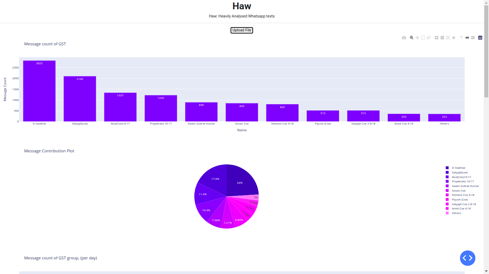
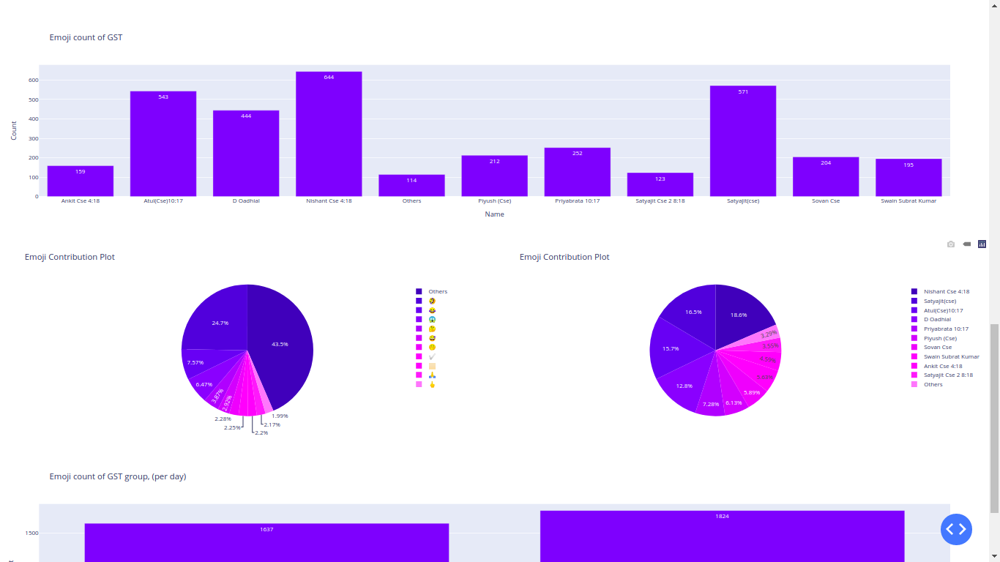

# Haw: Heavily Analyzed WhatsApp messages
This is a pretty standard and straightforward dashboard to show your the analytics made on your whatsapp group text.
In this, I've used Dash, which is a wrapper on the top of Flask, and Plotly plots to generate high quality, interactive plots.




### Features:
* Contribution plot for messages (Bar & Pie)
* Contribution plot for emojis (Bar & Pie)
* Day, Month and Year wise messages and emoji contribution
* Types of emoji contributed

### Goals :
- [ ] Getting advanced insights like which time of the day the group is highly active.
- [ ] Track how the name of the group changed over time.
- [ ] Count number of whishes and thank yous.
- [ ] Automate the file fetching part from Google Drive.

## How to run?

```
git clone https://github.com/swainsubrat/Haw.git
cd Haw
```

### 1. With docker
- To build the image

```
docker build -t image_name:tag_name .
```
- To run it
```
docker run -p 5000:5000 image_name:tag_name
```
For detached mode, use
```
docker run -d -p 5000:5000 image_name:tag_name
```

NOTE: image_name and tag_name should follow the docker guideline for naming images.

### 2. Without docker

```
pip install -r requirements.txt
python app.py
```

## How to use it?

1. Go to WhatsApp -> Open a group -> Options -> More -> Export.
2. Choose withoud media and download the text file.
3. Run the application and upload the file as shown in figure 1.

I want to thank these guys for letting use their names in a public repository.

1. Ankit Agrawal
2. Atul Kumar Agrawal
3. Bijayee Saswat Pradhan
4. Debadutta Padhial
5. Nishant Routray
6. Piyush Pattnaik
7. Priyabrata Mohapatra
8. Satyajit Behera
9. Satyajit Mohapatra
10. Shovan Behera